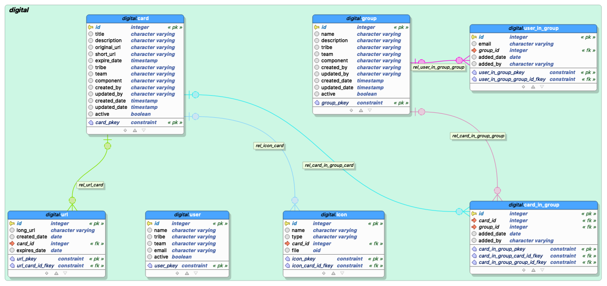

# Digital Organization API's

[](https://circleci.com/gh/abhayshukla04/digital-org)

[](https://travis-ci.com/digital-team-dto/digital-org)

[](https://www.codacy.com?utm_source=github.com&amp;utm_medium=referral&amp;utm_content=abhayshukla04/digital-org&amp;utm_campaign=Badge_Grade)

[](https://codecov.io/gh/abhayshukla04/digital-org)

## 1. How to start in local
```
$ git clone [https://github.com/abhayshukla04/digital-org.git](https://github.com/abhayshukla04/digital-org.git)
$ cd digital-org
$ mvn spring-boot:run

```

http://localhost:8080/swagger-ui/#/

Heroku CLI :
```
$heroku login
$ heroku apps
$ heroku logs -t --app digital-org
```
## 2. Heroku Swagger UI
Swagger UI :https://digital-org.herokuapp.com/swagger-ui/#/

## DB Design :



SQL : (src/main/resources/sql/digital.sql)

## 3. Tech Stack
```
spring-boot : 2.3.3.RELEASE
PostgreSQL : 12
```
## 3. Design Diagram
